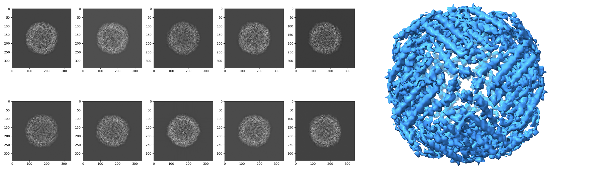
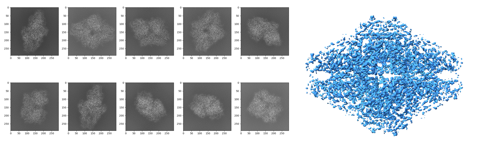
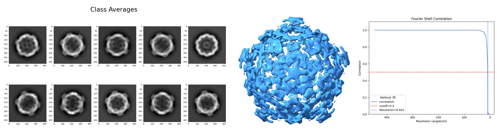
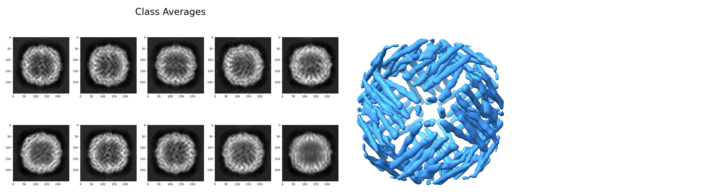
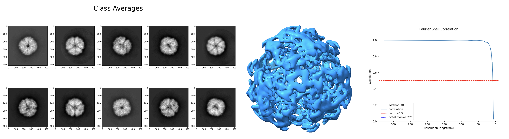

# CryoSym

Ab-initio reconstruction of symmetric molecules from cryo-EM projection images.

CryoSym estimates 3D molecular structures from 2D projection images by exploiting point-group symmetry constraints through a common-lines approach. Given a set of projection images and a symmetry type, it estimates the orientation corresponding to each projection-image and reconstructs the underlying 3D volume.

## Supported Symmetry Groups

CryoSym supports the following point-group symmetries:

| Family | Groups | Order | Description |
|-----|--------|-------|-------------|
| $C_n$ [NOT YET] | $C_2, C_3, C_4, \ldots$ | $n$ | Cyclic ($n$-fold rotational, $n > 1$) |
| $D_n$ | $D_2, D_3, D_4, \ldots$ | $2n$ | Dihedral ($n > 1$) |
| $T$ | $T$ | $12$ | Tetrahedral |
| $O$ | $O$ | $24$ | Octahedral |
| $I$ | $I$ | $60$ | Icosahedral |

## Requirements

- **Python 3.11+** (3.11.9 and 3.13.5 only versions tested)

Key Python dependencies (installed via `requirements.txt`):
- [ASPIRE](https://github.com/ComputationalCryoEM/ASPIRE-Python) — cryo-EM image processing
- [EMalign](https://pypi.org/project/EMalign/) — volume alignment
- PyQt5 — interactive projection viewer GUI
- NumPy, SciPy, matplotlib, pyfftw, mrcfile

## Installation

```bash
git clone https://github.com/itamero/cryo_sym
cd cryosym
python3.11 -m venv venv
source venv/bin/activate
pip install -r requirements.txt
```

## Usage

CryoSym provides two entry points: a **simulation demo** (synthetic data) and a **class averages reconstruction** (real experimental data).

### Simulation Demo

`ab_initio_simulation_demo.py` generates synthetic projection images from a known reference volume, then reconstructs the 3D structure from those projections.

```python
from ab_initio_simulation_demo import ab_initio_simulation_demo

ab_initio_simulation_demo(
    sym="O",              # Symmetry group
    num_imgs=20,          # Number of simulated projection images
    noise_variance=0.0,   # Noise level (0.0 = noiseless)
    ds_rot_est=79,        # Downsample size for rotation estimation
    ds_reconstruct=121,   # Downsample size for reconstruction
    resolution="mid",     # Resolution preset: "low", "mid", or "high"
    interactive=True,     # Show projection images during processing
    gui=False,            # Show interactive PyQt5 projection viewer
)
```

Or run it directly:

```bash
python ab_initio_simulation_demo.py
```
Below are the reconstructed volumes from the simulation demo for $O$ and $D2$ symmetries (with noiseless projections). The simulated projection images are shown on the left and the reconstruction is shown on the right.



The reference volume is downloaded automatically from EMDB on first run.

Pre-configured reference volumes from the [Electron Microscopy Data Bank (EMDB)](https://www.ebi.ac.uk/emdb/) are available for the following symmetries:

| Symmetry | EMD ID | | Symmetry | EMD ID |
|----------|--------|-|----------|--------|
| $T$ | 10835 | | $D_2$ | 2984 |
| $O$ | 4905 | | $D_3$ | 14803 |
| $I$ | 3952 | | $D_4$ | 22308 |
| $C_2$ | 2824 | | $D_5$ | 28025 |
| $C_3$ | 2484 | | $D_6$ | 22358 |
| $C_4$ | 5778 | | $D_7$ | 6287 |
| $C_5$ | 3645 | | $D_8$ | 9571 |
| $C_{11}$ | 6458 | | $D_{10}$ | 10920 |
The table above lists only the symmetries with pre-configured volumes. You can also supply a custom EMD ID.


### Class Averages Reconstruction

`ab_initio_class_averages_reconstruction.py` reconstructs a 3D volume from real class average images stored as `.mrc` files in `data/class_averages/`.

Pre-configured class averages are available for the following symmetries:

| Symmetry | EMPIAR ID | EMDB ID |
|----------|-----------|---------|
| $T$ | 10389 | 10835 |
| $O$ | 10272 | 4905 |
| $I$ | 10205 | 3952 |
| $D_3$ | 12036 | 14803 |
| $D_4$ | 10502 | 22308 |
| $D_7$ | 10025 | 6287 |

Download them from [Google Drive](https://drive.google.com/drive/folders/10hyWT1Hj5EFfemrbQAS_LxKzMn4FYE2l?usp=sharing) and place the `.mrc` files in `data/class_averages/`.

```python
from ab_initio_class_averages_reconstruction import class_averages_reconstruction

class_averages_reconstruction(
    sym="O",              # Symmetry group
    n_projs=50,           # Number of class averages to use
    resolution="low",     # Resolution preset: "low", "mid", or "high"
    ds_rot_est=75,        # Downsample size for rotation estimation
    ds_reconstruct=120,   # Downsample size for reconstruction
    gui=False,            # Show interactive PyQt5 projection viewer
)
```

Or run it directly:

```bash
python ab_initio_class_averages_reconstruction.py
```
Below are the reconstructed volumes from the class averages for $I$, $O$ and $T$ symmetries. The class average images are shown on the left and the reconstruction is shown on the middle as well as the FSC plots.




## Key Parameters

| Parameter | Values | Description                                                                                                                                               |
|-----------|--------|-----------------------------------------------------------------------------------------------------------------------------------------------------------|
| `sym` | `"C3"`, `"D7"`, `"O"`, `"I"`, ... | Point-group symmetry of the molecule                                                                                                                      |
| `resolution` | `"low"`, `"mid"`, `"high"` | Controls the angular thresholds for rotation estimation. Lower resolution is faster but less precise. Higer resolutions can be computationally intensive. |
| `ds_rot_est` | int (e.g. 70–79) | Image size (in pixels) used during rotation estimation. Provided projection-images are downsampled to the specified resolution.                           |
| `ds_reconstruct` | int (e.g. 120–121) | Image size (in pixels) used for final volume reconstruction.                                                                                              |
| `basis` | `"Dirac"`, `"FFB"` | Basis for ASPIRE's volume reconstruction. `"Dirac"` uses a direct voxel basis; `"FFB"` uses a Fourier-Bessel basis.                                       |
| `noise_variance` | float (e.g. 0.0) | Noise level for the simulation demo. 0.0 means noiseless.                                                                                                 |
| `gui` | `True` / `False` | Whether to launch the interactive PyQt5 projection-viewer GUI.                                                                                            |
| `interactive` | `True` / `False` | Whether to display projection images (matplotlib) during processing.                                                                                      |

## Project Structure

```
cryosym/
├── ab_initio_simulation_demo.py          # Simulation demo entry point
├── ab_initio_class_averages_reconstruction.py  # Class averages entry point
├── requirements.txt
├── cryosym/                              # Main package
│   ├── ab_initio_sym.py                  # Core reconstruction algorithm
│   ├── config.py                         # Path configuration
│   ├── estimate_rotations.py             # Absolute rotation estimation
│   ├── estimate_relative_rotations.py    # Relative rotation estimation
│   ├── cryo_create_rotations_cache.py    # Candidate rotations and common lines precomputation
│   ├── group_elements.py                 # Symmetry group elements
│   ├── gen_rotations_grid.py             # SO(3) rotation grid sampling
│   ├── utils.py                          # Plotting, alignment, and I/O utilities
│   ├── projection_guis/                  # Interactive projection viewers
│   │   ├── projection_gui_simulation.py
│   │   └── projection_gui_class_avgs.py
│   └── volume_download/                  # EMDB volume downloading
│       ├── data_downloader.py
│       └── symmetry_group_conventions.py
└── data/                                 # Data directory (created automatically)
    ├── downloaded_volumes/               # Reference volumes from EMDB
    ├── projections/                      # Projection images
    ├── class_averages/                   # Input class average .mrc files
    ├── rotations_cache/                  # Cached candidate rotations and common lines indices
    └── reconstructed_volumes/            # Output reconstructed volumes
```

## Output

Results are saved to `data/reconstructed_volumes/`. Each run creates a directory containing:

- **Reconstructed volume** (`.mrc`) — the estimated 3D structure.
- **FSC plot** (`fsc_plot.png`) — Fourier Shell Correlation curve with resolution estimate.
- **Projection images** (`.png`) — simulated or class average projections used as input.

The output directory and `.mrc` file are automatically renamed to include the FSC resolution score (e.g. `_FSC_8,50`).
